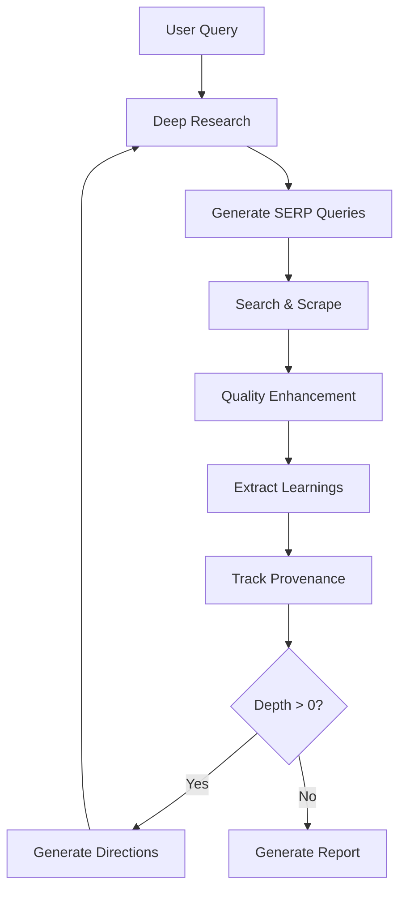

# Deep Research Python

An AI-powered research assistant that performs iterative, deep research on any topic by combining web search, content analysis, and large language models.

**🔬 Simple yet powerful research automation in Python**

The goal is to provide the simplest implementation of a deep research agent that can refine its research direction over time and dive deep into any topic. Optimized for ease of use and understanding.

## Features

- **🔄 Iterative Research**: Performs deep research by iteratively generating search queries, processing results, and diving deeper based on findings
- **🎯 Intelligent Query Generation**: Uses LLMs to generate targeted search queries based on research goals and previous findings
- **⚙️ Depth & Breadth Control**: Configurable parameters to control research scope (breadth: 1-20, depth: 1-10)
- **🔮 Smart Follow-up**: Generates follow-up questions to better understand research needs
- **📊 Web Dashboard**: Beautiful web interface with real-time progress tracking and organized result tabs
- **🔗 API Server**: REST API for integration with other applications
- **🚀 Concurrent Processing**: Handles multiple searches and result processing in parallel
- **🤖 Multiple AI Providers**: Support for NVIDIA, OpenAI, Fireworks AI, OpenRouter, and local models
- **✨ Advanced Features**:
  - **Semantic Re-ranking**: Orders results by relevance using sentence transformers
  - **Smart Deduplication**: Removes near-duplicate content automatically  
  - **Freshness Filtering**: Prioritizes recent information (configurable)
  - **Provenance Tracking**: Transparent source attribution with supporting snippets and confidence scores

## Quick Start

### 1. Installation

```bash
git clone https://github.com/Finance-LLMs/deep-research-python.git
cd deep-research-python
pip install -r requirements.txt
```

### 2. Configuration

Create a `.env.local` file with your API keys:

```bash
# Required: Web search and scraping
FIRECRAWL_KEY="your_firecrawl_key"

# AI Provider (choose one)
OPEN_ROUTER_KEY="your_openrouter_key"        # free models available
# NVIDIA_API_KEY="your_nvidia_api_key"       # Alternative - Llama 3.1 70B, DeepSeek R1
# OPENAI_KEY="your_openai_key"               # Alternative - GPT-4o-mini
# FIREWORKS_KEY="your_fireworks_key"         # Alternative - DeepSeek R1

# Optional: Advanced features
USE_RERANKING=true        # Enable semantic re-ranking (default: true)
DEDUP_THRESHOLD=0.9       # Deduplication threshold (default: 0.9)
MIN_YEAR=2020            # Minimum year for documents (default: 2020)
```

### 3. Usage Options

#### Web Dashboard (Recommended) 🚀
```bash
python run_dashboard.py
# Open http://localhost:5000
```

#### Command Line
```bash
python -m src.run
```

#### API Server
```bash
python -m src.api
# Server starts on port 3051
```

## AI Model Providers

The system automatically selects the best available model in this order:

1. **Custom Model** - if `CUSTOM_MODEL` and `OPENAI_ENDPOINT` are set
2. **DeepSeek R1** (OpenRouter) - if `OPEN_ROUTER_KEY` is set
3. **NVIDIA Llama 3.1 70B** - if `NVIDIA_API_KEY` is set
4. **DeepSeek R1** (Fireworks) - if `FIREWORKS_KEY` is set
5. **GPT-4o-mini** (OpenAI) - Fallback option

### Getting API Keys

**OpenRouter**
- Visit [openrouter.ai](https://openrouter.ai)
- Free tier includes access to many models
- Excellent DeepSeek R1 performance

**NVIDIA API**
- Visit [build.nvidia.com](https://build.nvidia.com)
- Free access to Llama 3.1 70B and DeepSeek R1
- Great for research applications

**Local/Custom Models**
```bash
OPENAI_ENDPOINT="http://localhost:1234/v1"
CUSTOM_MODEL="your_model_name"
OPENAI_KEY="your_api_key_if_needed"
```

## Usage

### Web Dashboard (Recommended) 🚀

Start the interactive web dashboard:

```bash
python run_dashboard.py
# Open http://localhost:5000
```

**Features:**
- **Interactive UI**: User-friendly web interface
- **Real-time Progress**: Live updates with visual progress bars
- **Organized Results**: Separate tabs for Output, Learnings, Sources, and Feedback
- **Download Reports**: Export as Markdown files
- **Provenance Display**: See supporting snippets and confidence scores for each learning

### Command Line Interface

```bash
python -m src.run
```

You'll be prompted to enter your research query and configure parameters:
- **Breadth**: Number of search queries per iteration (recommended: 2-10, default: 4)
- **Depth**: Number of research iterations (recommended: 1-5, default: 2)
- **Mode**: Generate report or specific answer

### API Server

```bash
python -m src.api
# Server starts on port 3051
```

**Endpoints:**

```bash
# Research with concise answer
curl -X POST http://localhost:3051/api/research \
  -H "Content-Type: application/json" \
  -d '{"query": "Tesla stock performance 2025", "breadth": 3, "depth": 2}'

# Generate detailed report
curl -X POST http://localhost:3051/api/generate-report \
  -H "Content-Type: application/json" \
  -d '{"query": "AI trends 2025", "breadth": 4, "depth": 2}'
```

## Advanced Features

### Enhanced Search Quality

The system includes advanced retrieval processing for higher quality results:

- **Semantic Re-ranking**: Orders search results by relevance using AI embeddings
- **Smart Deduplication**: Automatically removes near-duplicate content (configurable threshold)
- **Freshness Filtering**: Prioritizes recent information while filtering outdated content

**Configuration:**
```bash
USE_RERANKING=true        # Enable processing (default: true)
DEDUP_THRESHOLD=0.9       # Similarity threshold (default: 0.9)
MIN_YEAR=2020            # Minimum document year (default: 2020)
```

### Provenance Tracking

Every research finding includes transparent source attribution:

- **Source URLs**: Direct links to original documents
- **Supporting Snippets**: Exact 1-2 sentence excerpts supporting each learning
- **Confidence Scores**: Similarity scores showing reliability (0-100%)
- **Matched Terms**: Key terms found in supporting evidence

**Example Output:**
```markdown
### Learning #1
**Finding:** Python 3.12 introduces improved error messages

**Source:** "Python 3.12 now provides more detailed error messages..."
**From:** https://docs.python.org/3.12/whatsnew
**Confidence:** 95%
```

**Access Provenance Data:**
```python
from src.deep_research import deep_research

result = await deep_research("Your query", breadth=4, depth=2)

if result.learnings_with_provenance:
    for provenance in result.learnings_with_provenance:
        print(f"Learning: {provenance['learning']}")
        print(f"Source: {provenance['source_url']}")
        print(f"Evidence: {provenance['supporting_snippet']}")
        print(f"Confidence: {provenance['confidence_score']:.1%}")
```

## Configuration

| Variable | Description | Default | Options |
|----------|-------------|---------|---------|
| **Core APIs** | | | |
| `FIRECRAWL_KEY` | Firecrawl API key (required) | - | Your API key |
| `FIRECRAWL_BASE_URL` | Custom Firecrawl endpoint | `https://api.firecrawl.dev` | URL |
| `OPEN_ROUTER_KEY` | OpenRouter API key | - | Your API key |
| `NVIDIA_API_KEY` | NVIDIA API key | - | Your API key |
| `OPENAI_KEY` | OpenAI API key | - | Your API key |
| `FIREWORKS_KEY` | Fireworks AI API key | - | Your API key |
| **Local Models** | | | |
| `CUSTOM_MODEL` | Custom model name | - | Model name |
| `OPENAI_ENDPOINT` | Custom endpoint URL | - | http://localhost:1234/v1 |
| **Search Quality** | | | |
| `USE_RERANKING` | Enable retrieval processing | `true` | true/false |
| `DEDUP_THRESHOLD` | Deduplication threshold | `0.9` | 0.0-1.0 |
| `MIN_YEAR` | Minimum document year | `2020` | 2000-2025 |
| **Performance** | | | |
| `FIRECRAWL_CONCURRENCY` | Concurrent requests | `2` | 1-10 |
| `CONTEXT_SIZE` | Max context size | `128000` | Number |

## Docker Setup

1. Create `.env.local` file with your API keys
2. Build and run:

```bash
docker build -t deep-research-python .
docker run -p 3051:3051 --env-file .env.local deep-research-python
```

Or with Docker Compose:
```bash
docker compose up -d
```

## How It Works

The research process follows these steps:

1. **Query Analysis** - Takes user query and generates follow-up questions for refinement
2. **Search Generation** - Creates multiple targeted SERP queries based on research goals  
3. **Content Retrieval** - Searches web using Firecrawl API and scrapes relevant pages
4. **Quality Enhancement** - Applies semantic re-ranking, deduplication, and freshness filtering
5. **Learning Extraction** - Analyzes content to extract key insights and learnings
6. **Provenance Tracking** - Links each learning to supporting source snippets with confidence scores
7. **Iterative Deepening** - Generates new research directions and repeats if depth > 0
8. **Report Generation** - Compiles findings into comprehensive markdown reports



## Performance & Rate Limits

### Firecrawl Rate Limits

Configure concurrency based on your plan:

```bash
# Free tier
FIRECRAWL_CONCURRENCY=1

# Paid tier or self-hosted
FIRECRAWL_CONCURRENCY=5
```

### Performance Tips

- **Start small**: Use `breadth=2, depth=1` for testing
- **Monitor rate limits**: Watch for 429 errors and adjust concurrency
- **Use faster models**: NVIDIA models are generally quicker
- **Self-host Firecrawl**: For unlimited scraping

## Troubleshooting

### Common Issues

| Issue | Solution |
|-------|----------|
| "No model found" error | Ensure at least one AI provider API key is set |
| Rate limit errors | Reduce `FIRECRAWL_CONCURRENCY` or upgrade Firecrawl plan |
| Empty search results | Check Firecrawl API key and connectivity |
| Import/dependency errors | Run `pip install -r requirements.txt` |
| Slow processing | Enable GPU, use smaller parameters, or faster model |

### Enable Debug Output

Modify logging in `src/deep_research.py`:

```python
def log(*args):
    print(*args)  # Enable all debug output
```


## License

This project is licensed under [MIT LICENSE](LICENSE).